# Introduction To GitHub


## Table Of Content

* Basic Introduction
* What Is GitHub?
* Why GitHub
* Git Vs GitHub
* Cloning In GitHub
* Pull Request
* Making A commit In GitHub
* GitHub Desktop Vs GitHub CLI

## Introduction

GitHub is a term that is frequently used in discussions about software development, in this article we will learn what it is and some of the basic functions it can accomplish.


## What is Github?

To fully comprehend GitHub, we must first understand what git is.

<a href="https://git-scm.com/" target="">According to its official documentation,</a>
 Git is a free and open source distributed version control system designed to handle everything from small to very large projects with speed and efficiency.
Therefore, GitHub is an online software development platform that makes use of Git, an open source version control technology used for project storage, tracking, and collaboration.


## Why Github?

Aside from being one of the biggest communities for programmers, using GitHub is cost-free if your project is publicly available and comes with a wiki and issue tracker that make it simple to provide more detailed documentation and obtain feedback on your work. To contribute, simply fork a project, make your modifications, and then send them a pull request via the GitHub web interface; we will become acquainted with these terminologies as we progress.

## Git Vs GitHub

 **Git**                              | **GitHub**                                         
:------------------------------------:|:--------------------------------------------------:
 Git was first released in 2005       | GitHub was released in 2008                        
 Git is maintained by Linux           | GitHub is maintained by Microsoft                  
 It is a local version control system | GitHub is a web/cloud-based hosting service        
 It is used in the Command Line       | GitHub has a graphical user interface              
 It is Completely Free                | GitHub has a free plan and it also has a paid plan 


## Cloning In GitHub

 ### What you need
* A GitHub user account
* A terminal running bash, and
git installed and configured on your computer.

Git clone is a git command that creates a clone/copy of an existing repository in a new directory. Each branch in the cloned repository has a remote-tracking branch created for it as well. To obtain a development copy of an already-existing central repository, users most frequently use this command.


* We start by searching for a project repository that interests us and clicking on it to view its details. For instance, if I search for "initial contributions," clicking on it displays the picture below.

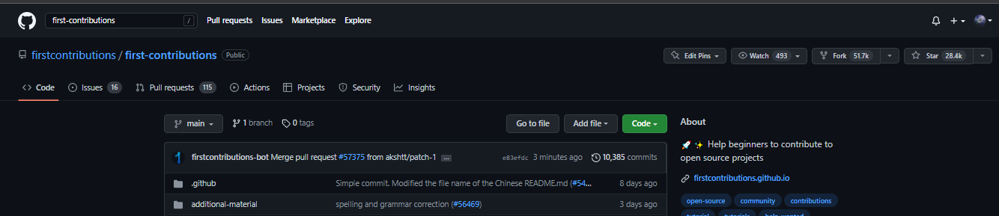

* Select the ```Code``` indicated green button on the right. Upon doing this, a drop-down menu with the choices HTTPS, SSH, and GitHub CLI will appear, as seen in the image below.

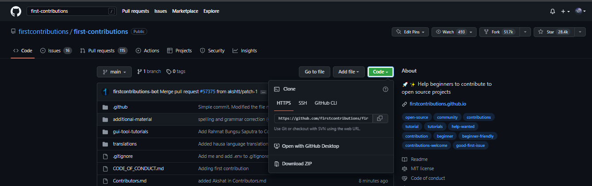

* For this Clone, I'll choose the HTTPS option, which I switch to before selecting the copy icon.

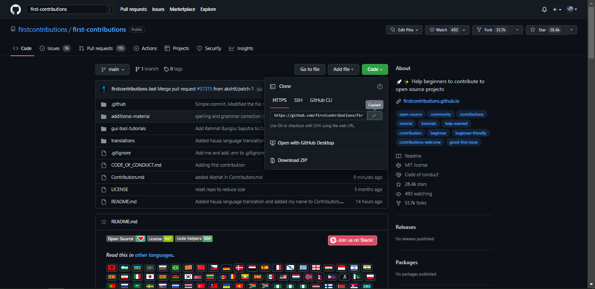

* Next i open my terminal , for this i will be making use of Git bash,

 * we navigate to a folder on our local machine and, while connected to the internet, enter the git clone command.

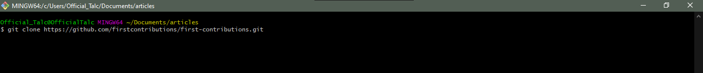

* Doing this successfully i have cloned the remote Repository to my local machine.

## Pull Request

A pull request, also known as a merge request, is an event that occurs in software development when a contributor/developer is ready to begin the process of integrating new code modifications with the main project repository.

How do we go about making a pull request?

* Create a local clone by forking the main repository. The developer forks the main repository first, which they can clone onto their local system.

 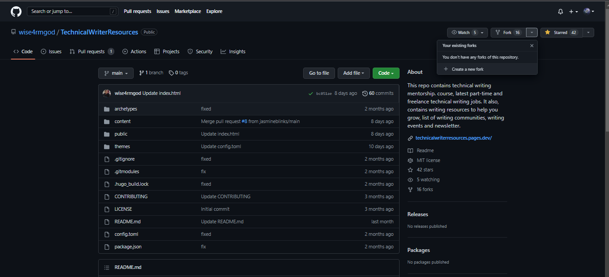

 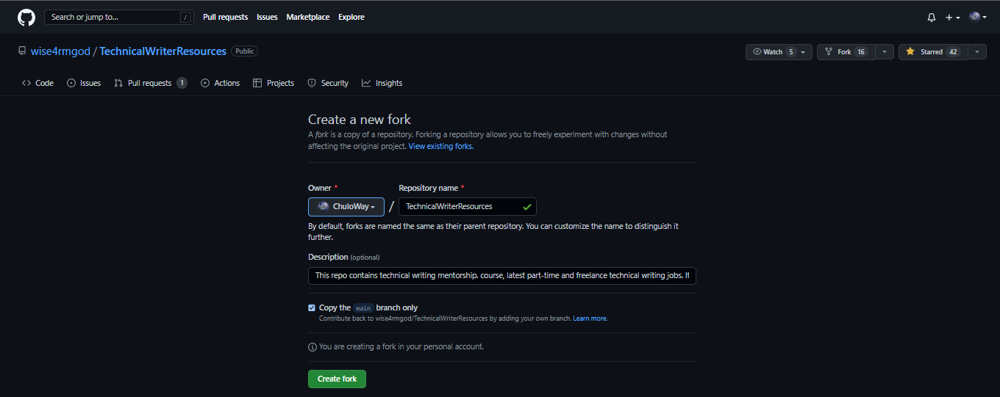

 * If you go to your repository list you will see the forked repo amongst your repositories.

 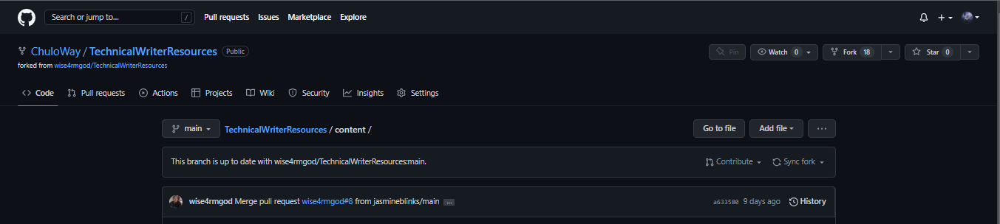

* Open your Terminal, Git Bash

* You then proceed to clone the remote repository to your local system, as we have shown prior to this section.

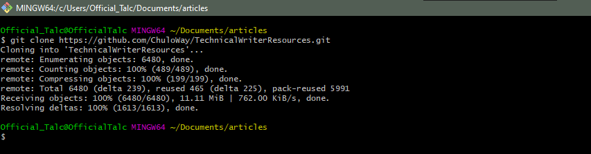

* To add a new branch to the repository, type the command line ```git checkout -b (name of the branch)```.

* Open the text editor Or Integrated Development Environment.

* Make the necessary local changes. The developer can then apply the necessary modifications to the code, whether they are working to fix a problem or add a new function.

* To view the changes you have made, type ```git status``` in the command line.

* Then, enter ```git add .``` to include all the modifications you've made and tell git that you want to incorporate them in the following commit.

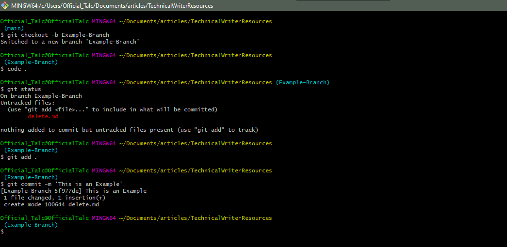

* You should see a message summarizing the changes you made after typing ```git commit -m 'The Commit Message Of The Changes Made' ``` and pressing Enter.

* Finally, enter the command ```git push --set-upstream origin < branch name >.```

* You  will see a break down of files pushed and time spent and a message that your git push was successful. Visit GitHub once more to view your pushed branch.


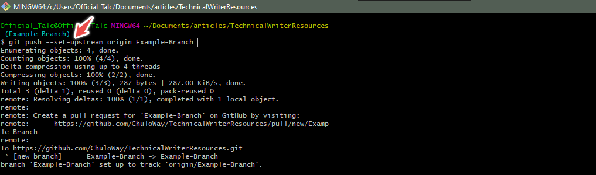

* Next You Go to your forked repository on GitHub and click on the right-hand side of the new branch to reveal a green button labeled "compare and pull request." Click that button to continue.

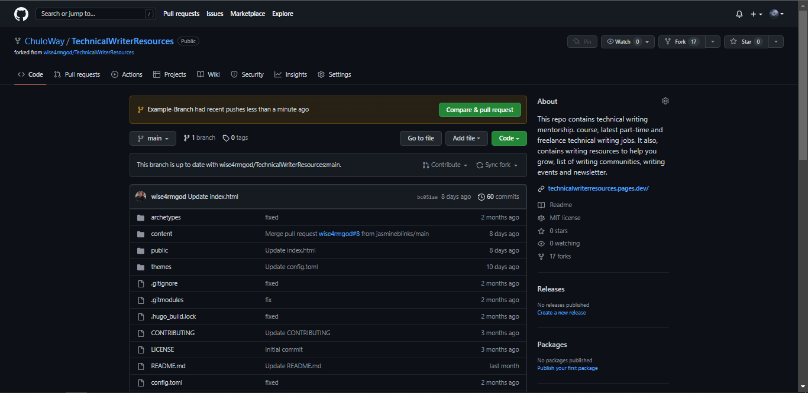


* You can write a message explaining why you want to submit a pull request to the owner and possibly the modifications you made in the text box that is located below these bars. Following that, select "create pull request." The maintainer will then assess the work done in the developer's forked repository and make any comments for some adjustments to be made or successfully Merge the Pull request.

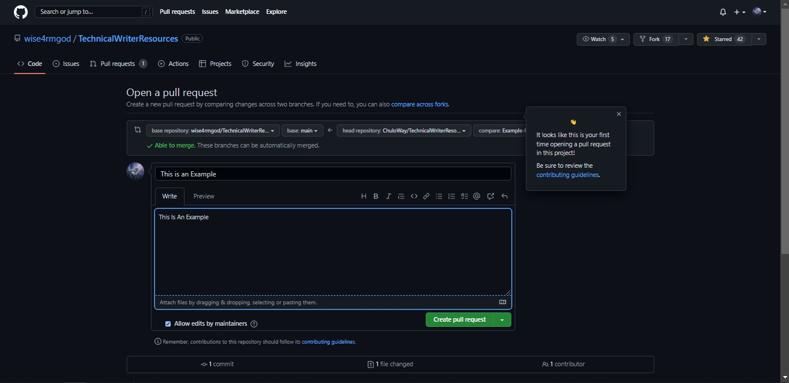


* You have successfully submitted a pull request; now you must wait for the repository maintainer to accept your request and publish the modification you made.


## What Is Git Commit And How Do We Make Use Of It?

The ```git commit``` command is used to save your changes to the local repository after making any necessary changes to the project you are working on.
Keep in mind that before using the "git commit" command, you must specifically tell Git which modifications you want to include. This implies that just because a file has been modified, it won't necessarily be added to the subsequent commit. Instead, you must indicate the required modifications for inclusion using the "git add" command.

We use ```git add <filename>``` to select the file to include, or ```git add . ``` to include all files in the directory., Then we commit using the git command.

  ```git commit -m "commit message"``` the hyphen with m indicates that we want to add a message with the commit.

## GitHub Desktop Vs GitHub CLI

<a href="https://docs.github.com/en/desktop" target="">According to GitHub Official Documentation,</a>
GitHub Desktop is an application that enables you to interact with GitHub using a GUI instead of the command line or a web browser. GitHub Desktop encourages you and your team to collaborate using best practices with Git and GitHub. You can use GitHub Desktop to complete most Git commands from your desktop with visual confirmation of changes. You can push to, pull from, and clone remote repositories with GitHub Desktop, and use collaborative tools such as attributing commits and creating pull requests.

While GitHub CLI is short for GitHub Command Line
GitHub CLI is a command-line tool that brings pull requests, issues, GitHub Actions, and other GitHub features to your terminal, so you can do all your work in one place.

## Conclusion

Utilizing git and GitHub for projects increases productivity and improves teamwork and as a beginner in software development it is essential to your career path. 
I sincerely hope that this article was useful in introducing you to Git and GitHub and explaining how they operate.


	


